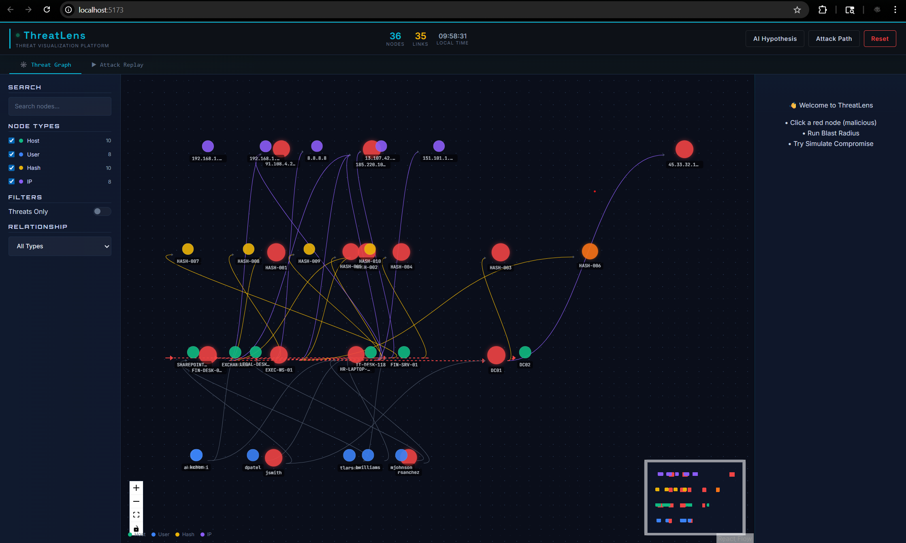

```
████████╗██╗  ██╗██████╗ ███████╗ █████╗ ████████╗██╗     ███████╗███╗   ██╗███████╗
╚══██╔══╝██║  ██║██╔══██╗██╔════╝██╔══██╗╚══██╔══╝██║     ██╔════╝████╗  ██║██╔════╝
   ██║   ███████║██████╔╝█████╗  ███████║   ██║   ██║     █████╗  ██╔██╗ ██║███████╗
   ██║   ██╔══██║██╔══██╗██╔══╝  ██╔══██║   ██║   ██║     ██╔══╝  ██║╚██╗██║╚════██║
   ██║   ██║  ██║██║  ██║███████╗██║  ██║   ██║   ███████╗███████╗██║ ╚████║███████║
   ╚═╝   ╚═╝  ╚═╝╚═╝  ╚═╝╚══════╝╚═╝  ╚═╝   ╚═╝   ╚══════╝╚══════╝╚═╝  ╚═══╝╚══════╝
```

```ini
SYSTEM      : Cybersecurity Threat Visualization Platform
VERSION     : 1.0
STATUS      : OPERATIONAL
CLEARANCE   : OPEN SOURCE
BUILT FOR   : Portfolio — Threat Hunting & SOC Analysis
```

[](https://www.python.org/downloads/)
[](https://fastapi.tiangolo.com/)
[](https://react.dev/)
[](https://neo4j.com/)
[](https://ai.google.dev/)
[](./LICENSE)

---

## See the attack. Not the logs.

---

## Overview

**ThreatLens** is a full-stack cybersecurity threat visualization platform that transforms raw network security data into an interactive visual graph. Instead of reading thousands of log lines, security analysts can see a cyberattack unfold in real time — tracing lateral movement, identifying blast radius, and generating AI-powered threat assessments.

Originally built for the **YNOV Campus Paris Global Hackathon (PS029)** where it reached the **Paris Finals — Top 4 out of 91 teams**. Rebuilt from scratch as a personal portfolio project with a cleaner architecture, a richer data model, and a more complete feature set.

---

## Dashboard Preview



*Interactive threat graph visualization — screenshot placeholder*

---

## Core Features

```
──────────────────────────────────────────────────────────
 FEATURE                          DESCRIPTION
──────────────────────────────────────────────────────────
 → Interactive Threat Graph       Timeline-based force graph, color-coded by node type and severity
 → Smart Filter Panel             Filter by node type, relationship, threats-only toggle, live search
 → Blast Radius Simulator         BFS traversal up to 4 hops — visualizes compromise spread
 → Attack Path Highlighter        Shortest path between any two nodes with hop count
 → Risk Propagation Engine        Animated compromise simulation — red → orange → yellow by depth
 → Attack Replay                  Chronological playback of the attack timeline with scrubber
 → AI Hypothesis Engine           Real Gemini AI generates structured threat assessment reports
──────────────────────────────────────────────────────────
```

---

## Attack Scenario

The platform includes a **complete APT simulation** seeded with realistic cybersecurity data:

```
ENTRY POINTS     →  FIN-DESK-042 (Emotet phishing) + HR-LAPTOP-07 (chrome_update.exe)
KILL CHAIN       →  Phishing → Emotet → Cobalt Strike → Lateral Movement → DC01 → Exfiltration
MALICIOUS IPs    →  185.220.101.45 (C2/Cobalt Strike) · 45.33.32.156 (Exfil) · 91.108.4.200 (Phishing)
MITRE TECHNIQUES →  T1566 · T1204 · T1059 · T1003 · T1021 · T1071 · T1041 · T1547 · T1078
GRAPH SIZE       →  36 nodes · 35 relationships · 4 node types · 4 relationship types
```

---

## Tech Stack

| Layer | Technology | Purpose |
|-------|-----------|---------|
| **Backend** | FastAPI (Python 3.10) | RESTful API, real-time data serving |
| **Database** | Neo4j Aura | Property graph database for relationship visualization |
| **AI Engine** | Google Gemini API | Intelligent threat assessment and analysis |
| **Frontend** | React 18 + Vite | Interactive SPA dashboard |
| **Graph Library** | ReactFlow v11 | Force-directed graph visualization with timeline |
| **HTTP Client** | Axios | API communication layer |

---

## System Structure

```
ThreatLens/
├── app.py                  ← FastAPI backend — 5 endpoints + auto docs
├── seed_data.py            ← Neo4j APT scenario seeder
├── requirements.txt        ← Python dependencies
├── .env.example            ← Environment variable template
├── utils/
│   ├── neo4j_client.py     ← Graph database client
│   └── gemini_client.py    ← AI hypothesis engine
└── frontend/
    └── src/
        ├── App.jsx         ← Full dashboard — 7 features
        ├── App.css         ← Dark SOC terminal theme
        └── main.jsx        ← React entry point
```

---

## API Endpoints

| Method | Endpoint | Description |
|--------|----------|-------------|
| **GET** | `/api/health` | Health check and API status |
| **GET** | `/api/graph` | Fetch all nodes and relationships |
| **GET** | `/api/hypothesis` | Generate AI-powered threat assessment |
| **GET** | `/api/blast-radius/{node_id}` | BFS traversal — reachable nodes up to 4 hops |
| **GET** | `/api/attack-path/{source_id}/{target_id}` | Shortest attack path between two nodes |

---

## Deployment

### Requirements

```
─────────────────────────────────────
 Python     3.10+
 Node.js    20 LTS
 Neo4j      Aura free cloud instance
 Gemini     API key (free tier)
─────────────────────────────────────
```

### Installation & Setup

```bash
# 1. Clone the repository
git clone https://github.com/rudrasingh-007/Threat-Lens.git
cd Threat-Lens

# 2. Backend setup
python -m venv venv
venv\Scripts\Activate        # Windows (or `source venv/bin/activate` on Linux/Mac)
pip install -r requirements.txt

# 3. Environment configuration
# Copy .env.example to .env and fill in your credentials:
#    - NEO4J_URI (Neo4j Aura connection string)
#    - NEO4J_USERNAME
#    - NEO4J_PASSWORD
#    - NEO4J_DATABASE
#    - GEMINI_API_KEY (from Google AI Studio)
cp .env.example .env
# Edit .env with your credentials

# 4. Seed the database with APT scenario
python seed_data.py

# 5. Start the FastAPI backend
python app.py                # Backend runs on http://localhost:5000

# 6. Frontend setup (in a new terminal)
cd frontend
npm install
npm run dev                  # Frontend runs on http://localhost:5173
```

**Access the platform:** Open `http://localhost:5173` in your browser.

---

## Roadmap

```
[COMPLETE]  Interactive threat graph with timeline layout
[COMPLETE]  7 core analyst features (filter, replay, blast radius, AI assessment, etc.)
[COMPLETE]  Real Gemini AI threat assessment engine
[COMPLETE]  APT attack scenario with MITRE ATT&CK technique IDs
[PLANNED]   Real Gemini API integration (CSV/PCAP upload)
[PLANNED]   MITRE ATT&CK framework mapping view
[PLANNED]   Live streaming graph updates for real-time threats
[PLANNED]   Demo mode — auto-runs all features in sequence
[PLANNED]   User authentication for multi-analyst support
```

---

## Author

```
AUTHOR      : Rudra Singh
BACKGROUND  : Cybersecurity Aspirant
HACKATHON   : Pre Qualifiers YNOV Campus Paris Global Hackathon — Paris Finals (Top 4 / 91 teams)
GITHUB      : github.com/rudrasingh-007
PORTFOLIO   : Built as a personal project to demonstrate full-stack cybersecurity tool development
```

---

## License

This project is licensed under the **MIT License** — see the [LICENSE](./LICENSE) file for details.

---

```
[ THREATLENS ] — GRAPH THE ATTACK. HUNT THE THREAT. — OPEN SOURCE
```
